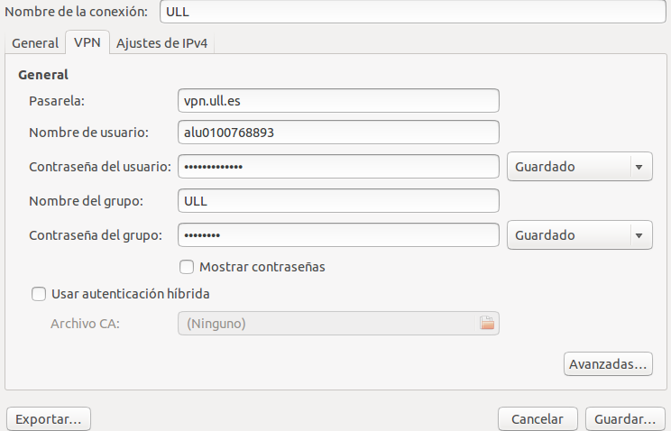
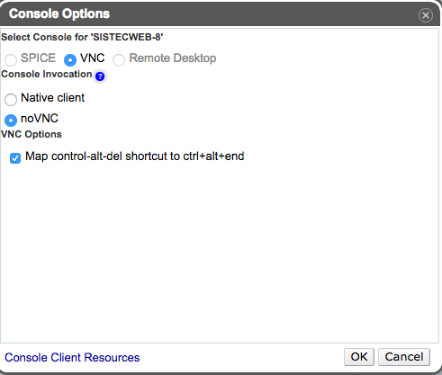

# Integrando el conversor en el servicio iaas

####En este repositorio se encuentra la realización de las dos primeras prácticas de la asignatura:
>#####[_Link al repositorio_](https://github.com/alu0100768893/ConversorDeTemperatura/tree/iaas)

####Pequeña aplicación web que realiza conversiones de temperatura:
>#####[_Link a la aplicación_](http://alu0100768893.github.io/ConversorDeTemperatura/)

####Se realizan pruebas sobre la aplicación con diferentes herramientas:
>#####[_Link a las pruebas_](http://alu0100768893.github.io/ConversorDeTemperatura/tests/index.html)

####Prácicas para la asignaura Sistemas y Tecnologías Web:
>#####[_Link a la asignatura_](http://eguia.ull.es/etsii/query.php?codigo=139264512)

####Autor:
>#####[_José Alberto Mena Gacía_](http://alu0100768893.github.io)

####iaas:
>#####[_Práctica en iaas_](http://10.6.128.77:8080/index.html)

#Pequeña guía sobre la integración con iaas

* Configuración de una red VPN para simular que estoy en la red de la ULL:

* Entramos a [iaas.ull.es](iaas.ull.es).

* Configuramos la máquina:

* Una vez dentro de la máquina, mediante un _ifconfig_ averiguamos la ip de la máquina.
 
* Para mayor comodidad, nos conectamos mediante ssh a la máquina desde una terminal en local:
>#####ssh usuario@ip.de.la.maquina

* Realizamos un clone del repo donde está la aplicación a integrar.

* Instalamos todas las dependencias:
>#####npm install

* Modificamos ip y puerto en nuestro servidor estático e instalamos las dependencias de node-static:
>#####npm install node-static --save-dev

* Accedemos a la aplicación online:
>#####http://ip.de.la.maquina:puerto/index.html
